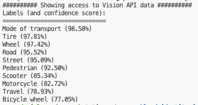

# GCP Workload Identity Federation: AWS EKS


This project is an example of Google's [Workload Identity Federation](https://cloud.google.com/iam/docs/workload-identity-federation) showcased from AWS' EKS with an OIDC provider enabled for the EKS cluster. This OIDC endpoint is needed for enabling IAM Roles for Service Accounts (IRSA) in the example application.

## Overview

Workload Identity Federation allows you to access Google Cloud resources from other cloud platforms, such as AWS, without needing to manage service account keys. This is a more secure method of authentication, as it avoids the need to store and manage long-lived credentials.

This project provides a working example of how to set up and use Workload Identity Federation with an application running on Amazon EKS. The example container is a simple Python script that uses the Google Cloud Vision API to analyze an image from AWS S3 and then write the image and analysis to a Google Cloud Storage bucket.


## Prerequisites

* An AWS account.
* A Google Cloud Platform project with Cloud Storage and Cloud Vision APIs enabled.
* `gcloud` CLI installed and configured.

### 1. Install a supported CLI

### Eksctl (AWS EKS CLI)
```bash
ARCH=amd64
PLATFORM=$(uname -s)_$ARCH
curl -sLO "https://github.com/eksctl-io/eksctl/releases/latest/download/eksctl_$PLATFORM.tar.gz"
tar -xzf eksctl_$PLATFORM.tar.gz -C /tmp && rm eksctl_$PLATFORM.tar.gz
sudo install -m 0755 /tmp/eksctl /usr/local/bin && rm /tmp/eksctl
```

### AWS CLI
```bash
#Install AWS CLI
curl -sLO "https://awscli.amazonaws.com/awscli-exe-linux-x86_64.zip" -o "awscliv2.zip"
unzip -q awscli-exe-linux-x86_64.zip -d /tmp/awscli && rm awscli-exe-linux-x86_64.zip
sudo /tmp/awscli/aws/install && rm -r /tmp/awscli
```

### Create Local Workload Identity Config
```bash
cp example-client-config.json client-config.json
```

## Setup

### 1. Build and Push Docker Image to ECR ([AWS ECR Instructions](https://docs.aws.amazon.com/AmazonECR/latest/userguide/getting-started-cli.html))

```bash
export AWS_ACCOUNT_ID=<AWS_ACCOUNT_ID>
export AWS_REGION=<AWS_REGION>
export AWS_ECR_REPO_NAME=<AWS_ECR_REPO_NAME>

#Log in to AWS Elastic Container Registry (ECR):
aws ecr get-login-password --region $AWS_REGION | docker login --username AWS --password-stdin $AWS_ACCOUNT_ID.dkr.ecr.$AWS_REGION.amazonaws.com

#Create a Repository
aws ecr create-repository \
--repository-name $AWS_ECR_REPO_NAME \
--region $AWS_REGION

#Build the local Docker image:
docker build -t gcp_wif_example .

#Tag the image for ECR:
docker tag gcp_wif_example:latest $AWS_ACCOUNT_ID.dkr.ecr.$AWS_REGION.amazonaws.com/$AWS_ECR_REPO_NAME:latest

#Push the image to your ECR repository:
docker push $AWS_ACCOUNT_ID.dkr.ecr.$AWS_REGION.amazonaws.com/$AWS_ECR_REPO_NAME:latest
```

### 2. Create the EKS Cluster

This command creates a basic EKS cluster with a single `t3.small` worker node. The `--with-oidc` flag is included to create an OIDC provider for the cluster, which is a prerequisite for enabling IAM Roles for Service Accounts (IRSA). This is crucial for allowing pods to assume IAM roles, a key part of workload identity.

Additionally, this creates the service accounts the pods will use and creates the ConfigMap with the Workload Identity configuration.

```bash
export CLUSTER_NAME=<CLUSTER_NAME>
export NAMESPACE=<NAMESPACE>

#Create EKS Cluster with OIDC Endpoint
eksctl create cluster \
  --name $CLUSTER_NAME \
  --region $AWS_REGION \
  --node-type t3.small \
  --nodes 1 \
  --nodes-min 1 \
  --nodes-max 1 \
  --with-oidc

export EKS_OIDC_URL=$(aws eks describe-cluster --name $CLUSTER_NAME --region $AWS_REGION --query "cluster.identity.oidc.issuer" --output text)

#Create Two Example Service Accounts
eksctl create iamserviceaccount \
  --cluster=$CLUSTER_NAME \
  --name=gcp-wif-service-account-1 \
  --namespace=$NAMESPACE \
  --role-name "gcp_wif_vision_role-1" \
  --attach-policy-arn=arn:aws:iam::aws:policy/AmazonS3ReadOnlyAccess \
  --approve

eksctl create iamserviceaccount \
  --cluster=$CLUSTER_NAME \
  --name=gcp-wif-service-account-2 \
  --namespace=$NAMESPACE \
  --role-name "gcp_wif_vision_role"-2 \
  --attach-policy-arn=arn:aws:iam::aws:policy/AmazonS3ReadOnlyAccess \
  --approve
```

### 3. Setup Google Cloud Workload Identity Federation and Permissions

```bash
export GCP_PROJECT_ID=<GCP_PROJECT_ID>
export GCP_PROJECT_NUMBER=<GCP_PROJECT_NUMBER>
export WORKLOAD_POOL_NAME=aws-wif-eks-pool
export WORKLOAD_PROVIDER_NAME=aws-wif-eks-provider

#Create Workload Identity Pool
gcloud iam workload-identity-pools create $WORKLOAD_POOL_NAME \
    --location="global" \
    --project=$GCP_PROJECT_ID \
    --description="AWS WIF Pool for EKS" \
    --display-name="AWS WIF Pool for EKS"

#Create Workload Identity Provider
gcloud iam workload-identity-pools providers create-oidc $WORKLOAD_PROVIDER_NAME \
    --location="global" \
    --project=$GCP_PROJECT_ID \
    --workload-identity-pool=$WORKLOAD_POOL_NAME \
    --issuer-uri=$EKS_OIDC_URL \
    --allowed-audiences='sts.amazonaws.com' \
    --attribute-mapping="google.subject=assertion.sub, attribute.namespace=assertion['kubernetes.io']['namespace'], attribute.service_account_name=assertion['kubernetes.io']['serviceaccount']['name'], attribute.pod=assertion['kubernetes.io']['pod']['name']"

#Update client-config.json with Workload Identity Parameters
sed -i \
  -e "s#<GCP_PROJECT_NUMBER>#$GCP_PROJECT_NUMBER#" \
  -e "s#<WORKLOAD_POOL_NAME>#$WORKLOAD_POOL_NAME#" \
  -e "s#<WORKLOAD_PROVIDER_NAME>#$WORKLOAD_PROVIDER_NAME#" \
  client-config.json

#Add IAM Permissions for One Service Account
gcloud projects add-iam-policy-binding $GCP_PROJECT_ID \
    --member="principal://iam.googleapis.com/projects/$GCP_PROJECT_NUMBER/locations/global/workloadIdentityPools/$WORKLOAD_POOL_NAME/subject/system:serviceaccount:$NAMESPACE:gcp-wif-service-account-1" \
    --role="roles/storage.objectUser"
```


### 4. Run the Container on EKS
- Pod 1 below will succeed because of the permissions given to gcp-wif-service-account-1 above
- Pod 2 below will fail with an error that it does not have the correct storage.buckets.list permissions

```bash
export AWS_IMAGE_SRC=<AWS_IMAGE_SRC>
export GCP_IMAGE_DST=<GCP_IMAGE_DST>

#Get Kubernetes Credentials
aws eks update-kubeconfig --name $CLUSTER_NAME --region $AWS_REGION

#Add Workload Identity Configuration to ConfigMap
kubectl create configmap wif-config \
  --from-file client-config.json \
  --namespace $NAMESPACE

#Export Example Kubernetes Pod YAML
cat >vision-pod.yaml <<EOF
apiVersion: v1
kind: Pod
metadata:
  name: vision-pod-1
spec:
  serviceAccountName: gcp-wif-service-account-1
  containers:
  - name: vision-app-1
    image: $AWS_ACCOUNT_ID.dkr.ecr.$AWS_REGION.amazonaws.com/$AWS_ECR_REPO_NAME:latest
    #command: ["tail", "-f", "/dev/null"]
    volumeMounts:
    - name: workload-identity-credential-configuration
      mountPath: "/etc/workload-identity"
      readOnly: true
    env:
    - name: GOOGLE_APPLICATION_CREDENTIALS
      value: "/etc/workload-identity/client-config.json"
    - name: GOOGLE_CLOUD_PROJECT
      value: $GCP_PROJECT_ID
    - name: AWS_IMAGE_SRC
      value: $AWS_IMAGE_SRC
    - name: GCP_IMAGE_DST
      value: $GCP_IMAGE_DST
  restartPolicy: Never
  volumes:
  - name: workload-identity-credential-configuration
    configMap:
      name: wif-config
---
apiVersion: v1
kind: Pod
metadata:
  name: vision-pod-2
spec:
  serviceAccountName: gcp-wif-service-account-2
  containers:
  - name: vision-app-2
    image: $AWS_ACCOUNT_ID.dkr.ecr.$AWS_REGION.amazonaws.com/$AWS_ECR_REPO_NAME:latest
    volumeMounts:
    - name: workload-identity-credential-configuration
      mountPath: "/etc/workload-identity"
      readOnly: true
    env:
    - name: GOOGLE_APPLICATION_CREDENTIALS
      value: "/etc/workload-identity/client-config.json"
    - name: GOOGLE_CLOUD_PROJECT
      value: $GCP_PROJECT_ID
    - name: AWS_IMAGE_SRC
      value: $AWS_IMAGE_SRC
    - name: GCP_IMAGE_DST
      value: $GCP_IMAGE_DST
  restartPolicy: Never
  volumes:
  - name: workload-identity-credential-configuration
    configMap:
      name: wif-config
EOF

#Apply the Manifest.
kubectl apply -f vision-pod.yaml --namespace=$NAMESPACE

#Check the Pods Status
kubectl get pods --namespace=$NAMESPACE

#View the container's output
kubectl logs vision-pod-1 --namespace=$NAMESPACE
```

### Debugging and Images
```bash
kubectl delete -f vision-pod.yaml --namespace=$NAMESPACE

kubectl apply -f vision-pod.yaml --namespace=$NAMESPACE

kubectl exec -it vision-pod-1 --namespace=$NAMESPACE -- /bin/bash
```
### Pod Status

### Pod 1

### Pod 2


### Example JWT from EKS' OIDC Endpoint (/var/run/service-account/token)
```json
{
  "aud": [
    "sts.amazonaws.com"
  ],
  "exp": 1753737233,
  "iat": 1753733633,
  "iss": "https://oidc.eks.us-east-1.amazonaws.com/id/C18F4AEEBBA49B049E58BC6DDBA546CB",
  "jti": "2813555a-7cb9-4568-af94-87e48fdda886",
  "kubernetes.io": {
    "namespace": "gcp-namespace",
    "node": {
      "name": "ip-192-168-21-21.ec2.internal",
      "uid": "c65ceaa6-7230-4558-aac7-c486f7a30260"
    },
    "pod": {
      "name": "vision-pod-1",
      "uid": "141b8ebe-400f-47fc-9611-e7e89e4f105e"
    },
    "serviceaccount": {
      "name": "gcp-wif-service-account-1",
      "uid": "28bfc2e2-88a1-4d04-86ed-46a567228d5c"
    }
  },
  "nbf": 1753733633,
  "sub": "system:serviceaccount:gcp-namespace:gcp-wif-service-account-1"
}
```

### 5. Clean Up

```bash
#Delete the Cluster
eksctl delete cluster --name $CLUSTER_NAME --region $AWS_REGION
```

## Contributing

Contributions are welcome! Please feel free to submit a pull request with any improvements or bug fixes.

## License

This project is licensed under the terms of the LICENSE file.
